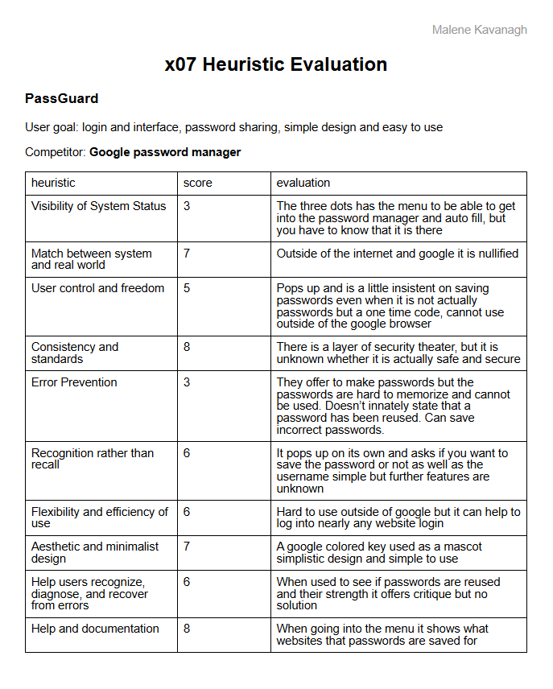
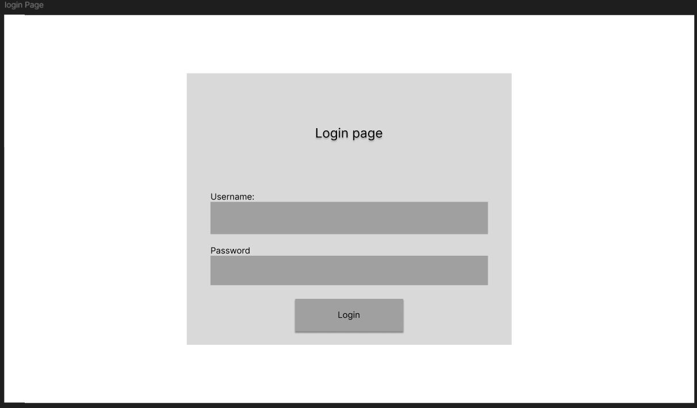
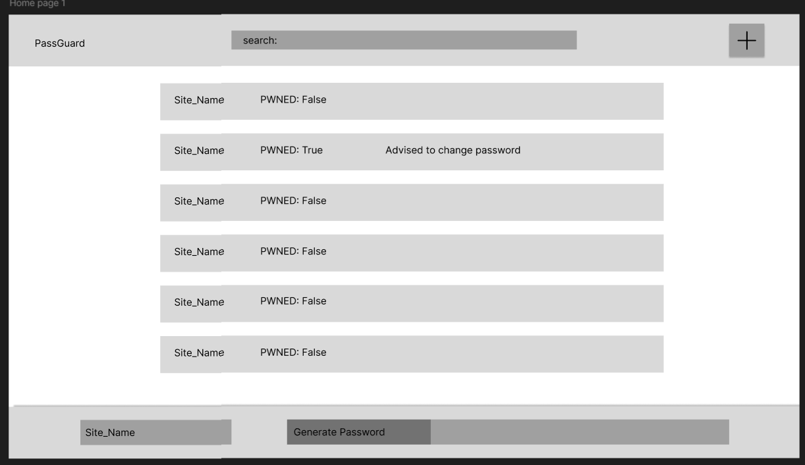
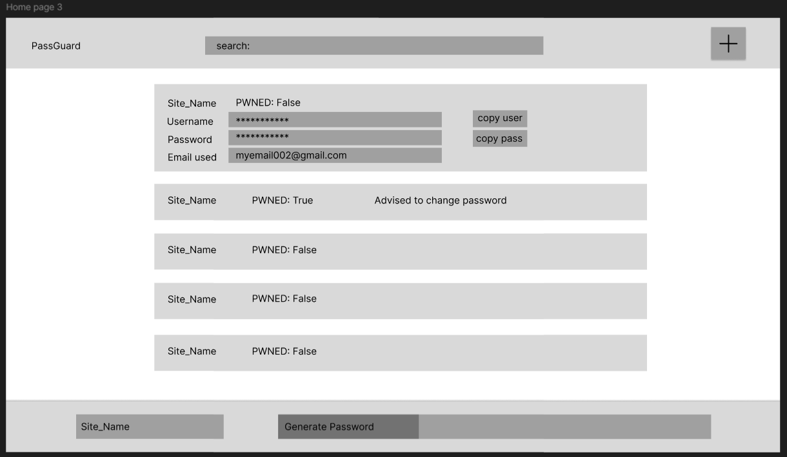
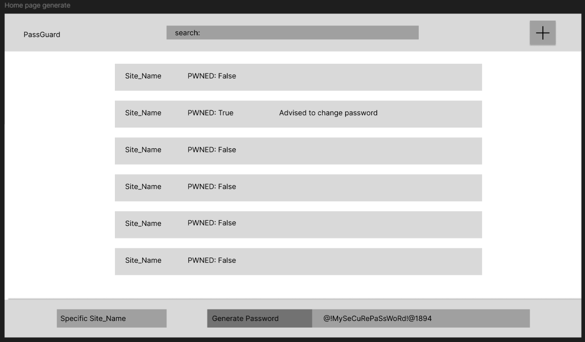
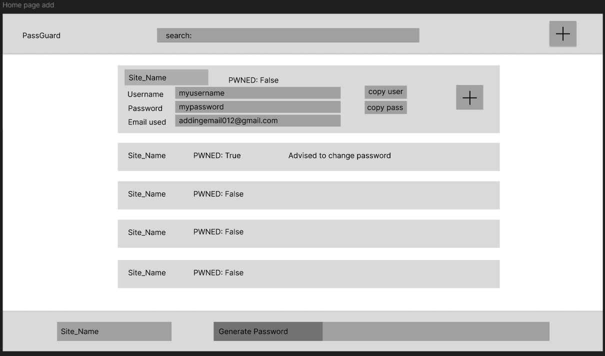

# Journal 01

## Malene Kavanagh   Date: 05/13/2025

I had a new experience with **Heuristics** where specific evaluation questions 
were asked while looking at a product similar to the one we are creating. this would be
to understand its strengths an weaknesses while also trying to find the niche we want to fill.
With this one I found Google password manager was an easy product to look at due to it being free.
Although the product is free and is able to auto fill the websites it is not a password manager first.
The niche we are looking at is a password sharing feature, this would actually be a great feature for 
clubs, teams, and possibly even companies who want their group to have a social media account that wouldn't 
be controlled by any one person while also keeping a relatively secure ability to change the password regularly.
This would be a strong contending feature if we are able to create it while also being secure.

then there was the **Cognitive** **Walkthrough** this is shows us if the layout and general function of our
product is understandable to a general user. Due to Error and Timing we did not get critiqued. Although we 
did not get critiqued quite yet I knows I need to add a sign up page.
